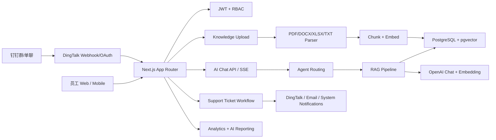
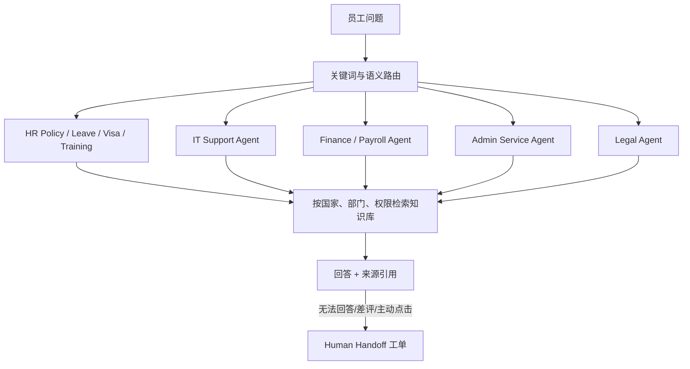
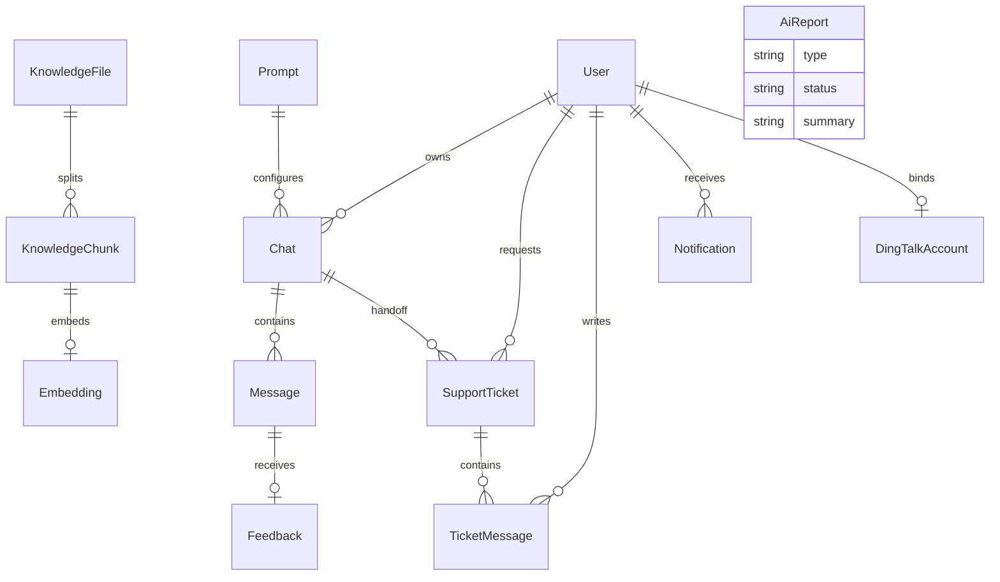

# HR AI 员工服务门户

企业内部 “AI + HR + IT + Finance + Admin” 智能员工服务系统。项目使用 Next.js、React、TypeScript、TailwindCSS、shadcn/ui、Prisma、PostgreSQL + pgvector、OpenAI SDK 与 Vercel AI SDK 构建。

## 核心能力

- Web 端 ChatGPT/Notion 风格 AI 咨询，支持流式输出、Markdown、引用来源、复制、反馈、转人工。
- RAG 知识库：PDF、DOCX、TXT、Markdown、Excel 解析、chunk、embedding、pgvector 检索。
- 多 Agent 路由：HR Policy、Leave、Payroll、IT Support、Finance、Admin、Legal、Visa、Training。
- 钉钉集成：群机器人/企业机器人 webhook、消息回复、OAuth 免登适配层、钉钉通知。
- Human Handoff：自动创建工单、部门分配、SLA、优先级、人工回复、保留会话记录。
- Analytics：咨询量、AI 解决率、转人工率、SLA 超时、满意度、知识库缺口。
- AI Reporting：周报/月报生成，预留 PDF/Excel/PPT 与钉钉/邮件推送出口。
- 安全：JWT、RBAC、知识库可见性、API 限流、审计日志。

## 快速开始

```bash
cp .env.example .env
docker compose up -d db redis
npm install
npm run db:generate
npm run db:push
npm run db:seed
npm run dev
```

默认账号：

- `admin@company.com`
- `Admin@123456`

## 环境变量

关键配置在 `.env.example`：

- `DATABASE_URL` / `DIRECT_URL`
- `OPENAI_API_KEY`
- `OPENAI_CHAT_MODEL`
- `OPENAI_EMBEDDING_MODEL`
- `JWT_SECRET`
- `DINGTALK_ROBOT_WEBHOOK`
- `DINGTALK_ROBOT_SECRET`
- `DINGTALK_WEBHOOK_TOKEN`
- `DINGTALK_APP_KEY`
- `DINGTALK_APP_SECRET`

## 系统架构



## Agent Routing



## 数据库 ER 图



## RAG 最佳实践

- Query Rewrite：把多轮上下文中的指代补全，保留国家、部门、时间、政策类型。
- Chunk：默认约 900 tokens，140 tokens overlap；制度类文档按标题/段落切分优先。
- Embedding：使用 `text-embedding-3-large`，向量维度 3072；pgvector 余弦距离召回。
- Top-K：默认 6，按国家 `country` 和知识库 `visibility` 做权限过滤。
- Prompt：强约束“只能基于知识库回答”，资料不足时明确说明并建议转人工。
- 幻觉控制：空 context 不回答政策细节；来源编号必须来自实际 chunk。
- 安全：用户输入只进入检索与受控 prompt，不允许覆盖系统规则。

## API 摘要

- `POST /api/auth/login` 登录
- `POST /api/auth/logout` 登出
- `GET /api/me` 当前用户
- `GET/POST /api/chats` 会话列表/创建
- `POST /api/chat` 流式 RAG 回答
- `GET/POST /api/knowledge` 知识库列表/上传
- `DELETE /api/knowledge/:fileId` 删除文件
- `GET/POST /api/tickets` 工单列表/创建
- `GET/PATCH /api/tickets/:ticketId` 工单详情/更新
- `POST /api/tickets/:ticketId/messages` 工单回复
- `POST /api/dingtalk/webhook` 钉钉机器人消息入口
- `GET /api/dingtalk/oauth?code=...` 钉钉 OAuth 免登入口
- `GET /api/analytics` 数据分析
- `POST /api/reports` AI 周报/月报

## 钉钉集成方案

1. 在钉钉开放平台创建企业内部应用或机器人。
2. 配置消息 webhook 到：`https://your-domain.com/api/dingtalk/webhook?token=你的DINGTALK_WEBHOOK_TOKEN`
3. 配置 OAuth 回调到：`https://your-domain.com/api/dingtalk/oauth`
4. 将机器人 webhook 与加签 secret 填入 `.env`。
5. 在群聊中 @机器人提问，系统会检索知识库并通过钉钉 markdown 消息回复。

当前 `exchangeDingTalkOAuthCode` 是租户适配边界，生产环境应替换为企业实际的钉钉服务端 SDK/API 调用。

## Docker 部署

```bash
docker compose up -d --build
docker compose exec app npx prisma db push
docker compose exec app npm run db:seed
```

生产环境建议在表创建后执行 `prisma/vector-indexes.sql`，启用 HNSW 向量索引和模糊搜索索引。

云部署：

- Vercel：使用托管 PostgreSQL + pgvector，配置环境变量，上传目录改为对象存储。
- AWS：ECS/Fargate + RDS PostgreSQL + ElastiCache Redis + S3。
- 阿里云：ACK/ECS + PolarDB PostgreSQL + Redis + OSS + 钉钉内网域名。
- 腾讯云：TKE/CVM + TencentDB PostgreSQL + Redis + COS。

## 文件结构

```text
app/                 Next.js 页面与 API Routes
components/          UI、导航、聊天、反馈组件
lib/ai/              RAG、Agent、文档解析、OpenAI 配置
lib/integrations/    钉钉等企业集成
lib/support/         工单路由、SLA、优先级
prisma/              schema、seed、pgvector 初始化
scripts/             离线 ingest 工具
```
