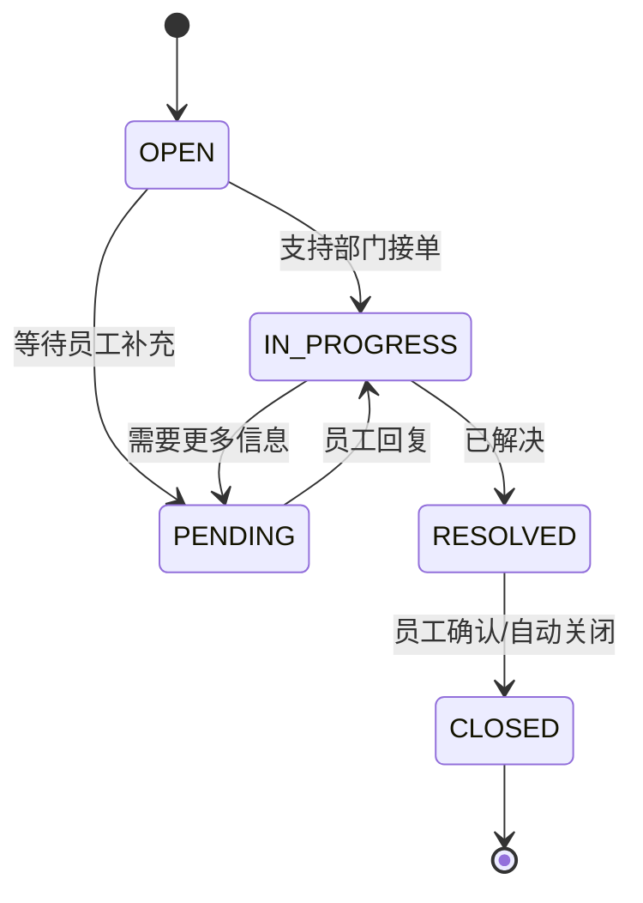
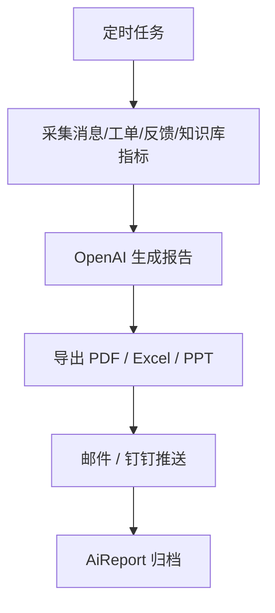

# V2 Architecture Notes

## 工单系统设计

SLA 按优先级自动计算：

- `URGENT`: 4 小时
- `HIGH`: 24 小时
- `MEDIUM`: 48 小时
- `LOW`: 72 小时

## Analytics Design

指标分层：

- AI 咨询：总咨询次数、DAU/MAU、热门问题、AI 解决率、平均响应时间。
- Handoff：转人工率、部门分布、SLA 超时、平均处理时长、未解决问题。
- AI 质量：无法回答、疑似幻觉风险、知识库缺失、高频失败主题。
- 满意度：赞踩、五星评分、文字反馈趋势。

## Reporting Workflow

## DingTalk Integration

钉钉入口分为三层：

- 群机器人 webhook：适合群聊 @机器人和群通知。
- 企业内部机器人：适合企业工作台、单聊、卡片按钮。
- OAuth 免登：Web 门户在钉钉内打开时自动识别员工。

生产注意：

- webhook 必须使用 token 校验和钉钉加签。
- OAuth 需要按企业应用类型替换 `exchangeDingTalkOAuthCode`。
- 消息卡片按钮应指向 `/tickets?chatId=...` 或 DingTalk AppLink。
- 群聊中注意脱敏，不回复员工个人敏感薪酬数据。
